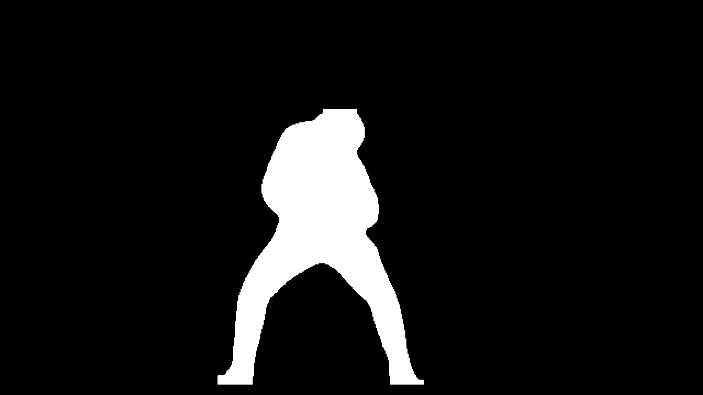

# Video-Person-Segmentation-and-Background-Replacement-using-YOLO11-Seg

This project uses the YOLO11n-seg model to process videos, achieving the following functionality:
- Segment people from videos
- Place the segmented people onto new backgrounds
- Remove people from the original video and repair the background

## Features

- Accurate human instance segmentation using Ultralytics YOLO11n-seg
- Automatic processing of every frame in the entire video
- Temporal smoothing to reduce mask flickering
- Generates three output videos:
  - **Segmented video**: Shows only the detected people
  - **Transplanted video**: Places people on a new background
  - **Inpainted video**: Removes people from the original video and repairs the background

## Installation

1. Clone this repository:
```bash
git clone https://github.com/XiChen211/Video-Person-Segmentation-and-Background-Replacement-using-YOLO11-Seg.git
cd Video-Person-Segmentation-and-Background-Replacement-using-YOLO11-Seg
```

2. Install dependencies:
```bash
pip install -r requirements.txt
```

## Usage

1. Prepare input files:
   - Prepare a video file containing people (e.g., basketball game video)
   - Prepare an image to use as the new background

2. Modify the `main` function in `test_yolo.py` to specify your input files:
```python
def main():
    video_path = "your_video.mp4"       # Input video path
    new_bg_path = "your_background.png"  # New background image path
    output_dir = "output"                # Output directory
    
    process_video(video_path, new_bg_path, output_dir)
```

3. Run the script:
```bash
python test_yolo.py
```

4. View the results:
   - Output files will be saved in the `output` directory
   - `segmented.mp4`: Shows only the segmented people
   - `transplanted.mp4`: People placed on the new background
   - `inpainted.mp4`: Original video with people removed

## Parameter Adjustment

If you need to adjust detection parameters, you can modify the arguments when calling the `process_video` function:

```python
process_video(video_path, new_bg_path, output_dir, conf_threshold=0.4)  # Increase confidence threshold
```


## Examples

Here are examples of the three types of output videos generated by this project:
### Original Video


### Segmented Video
Shows only the detected people from the original video:


### Transplanted Video
Places the segmented people onto a new background:


## Technical Details

- Uses the YOLO11n-seg deep learning model for human instance segmentation
- Applies mask temporal smoothing to reduce video flickering
- Uses OpenCV's inpaint algorithm (Telea method) for background repair

## Notice
This project is for entertainment purposes only!!!!!!


